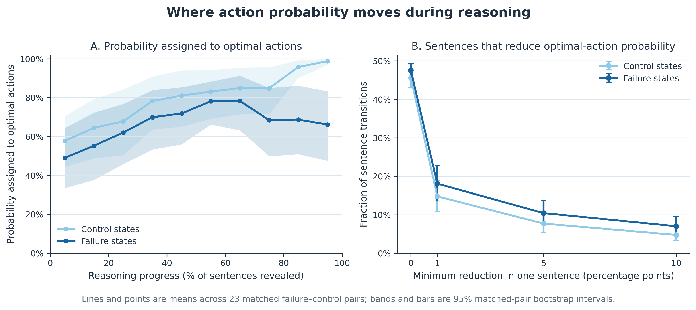
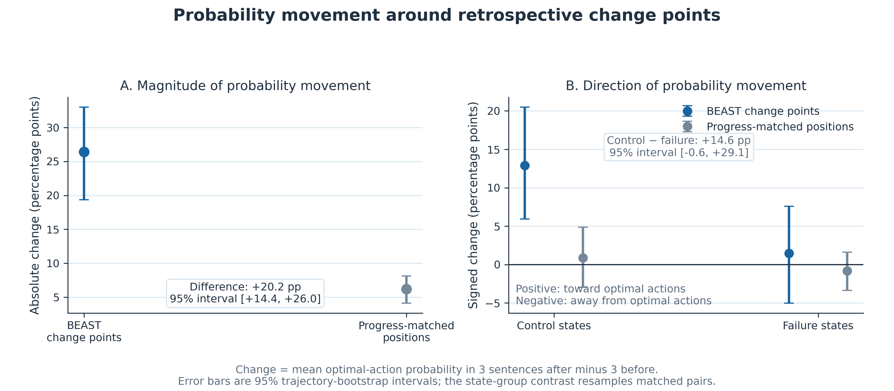

# Where action probability moves during reasoning

**Main result.** Failure and control states begin with similar probability assigned to optimal actions, but controls accumulate substantially more during reasoning. BEAST change points mark large probability revisions. These revisions move toward optimal actions on average in control states, but their average direction is close to zero in failure states.

## Measurement

The analysis contains 46 DoorKey states arranged in 23 matched failure–control pairs, 31 trajectories, and 7,084 sentence positions from GPT-OSS-20B. At each position, **optimal-action probability** is the sum of the readout probabilities assigned to every action that is optimal in that environment state.

For adjacent sentences, positive change means probability moved toward optimal actions; negative change means it moved away. For BEAST points, windowed change is the mean optimal-action probability in the three sentences after a position minus the mean in the three sentences before it. Every BEAST point was paired with a non-change-point position from the same state at similar reasoning progress. Intervals were calculated by resampling complete matched pairs or trajectories, as stated in each figure.

Failure and control states began similarly: 0.454 versus 0.410 optimal-action probability; paired difference +4.4 percentage points, 95% interval −11.5 to +21.1. From the initial to final readout, probability increased by 19.9 points in failure states and 59.0 in controls; paired difference −39.2 points, interval −67.9 to −13.5.

A sentence reduced optimal-action probability in 47.5% of failure-state transitions and 45.6% of control-state transitions; difference +2.0 points, interval −1.4 to +5.1. The interval includes zero at every minimum-change threshold shown in Panel B. The groups therefore differ in **net accumulation of optimal-action probability**, not clearly in how often individual decreases occur.

The 160 BEAST points showed a mean absolute windowed change of 26.4 percentage points, compared with 6.2 at progress-matched positions. The difference was +20.2 points, interval +14.4 to +26.0. Thus, BEAST identifies substantial revisions rather than ordinary local fluctuation.

At BEAST points, signed change averaged +12.9 points in control states and +1.5 in failure states. Across the 21 pairs containing points in both states, the control-minus-failure contrast was +14.6 points, interval −0.6 to +29.1. This interval narrowly includes zero. Among the 127 points recovered in at least 12 of 16 robustness reruns, the contrast was +20.9 points, interval +1.2 to +40.4; this subset result is exploratory.

## Interpretation

- **Supported:** reasoning contains large revisions of the action distribution; controls accumulate more probability on optimal actions; BEAST identifies unusually large revisions.
- **Suggestive:** repeatedly detected BEAST points may distinguish successful consolidation toward optimal actions from revisions that fail to improve the recommendation.
- **Not supported:** failure states simply have more change points or more sentence-level decreases.
- **Not established:** causation or real-time prediction. BEAST uses later observations to assign a change point retrospectively.

The analysis adopts the distance-from-initial-distribution transformation from [*Forking Paths in Neural Text Generation*](https://arxiv.org/abs/2412.07961v1), but it does not resample alternative continuations. These change points are changes in an immediate action readout, not causal forking sentences.

Full results and auditable tables: [`action_probability_flow_v1`](../outputs/hypothesis_tests/action_probability_flow_v1/run_report.md).
