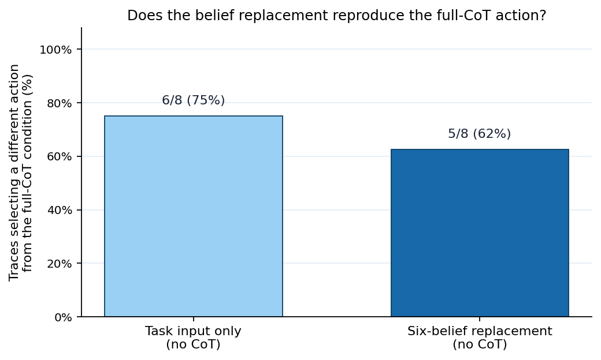
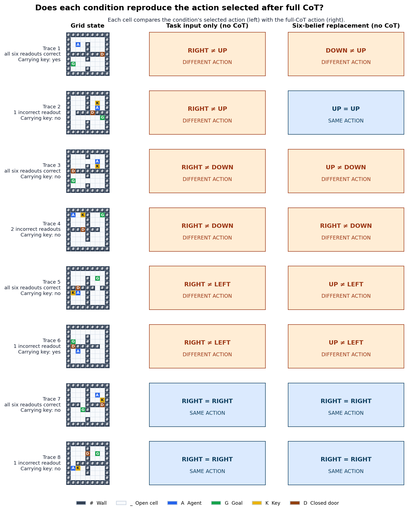

# Belief-replacement action pilot

## Question

Can six action-independent beliefs read out at the end of a reasoning trace replace that trace while preserving the model's selected action? The original grid and agent status remain visible in every condition.

## Smoke-test result

With the task input only (no CoT), 6/8 traces (75%) selected a different action from the full-CoT condition. With the six-belief replacement, 5/8 (62%) differed. The belief rescue rate was 1/6 (17%).

The mean total-variation distance from the full-CoT action distribution was 0.731 for task input only and 0.750 for the six-belief replacement. Lower is closer. The replacement therefore recovered the full-CoT action in one additional trace, but its action probabilities were slightly farther from the full-CoT probabilities on average. Taken together, this smoke test does not yet provide clear evidence that the six beliefs recover the action-relevant content of the omitted reasoning.

## Trace-level actions

The figure shows the exact grid and both action comparisons for every smoke-test trace. In each comparison cell, the action on the left is selected under that condition and the action on the right is the full-CoT reference.

| Trace | Final belief quality | Task input only (no CoT) | Full CoT | Six-belief replacement | Replacement agrees? |
|---:|---|---|---|---|---|
| 1 | all correct (0 errors) | RIGHT | UP | DOWN | No |
| 2 | at least one incorrect (1 errors) | RIGHT | UP | UP | Yes |
| 3 | all correct (0 errors) | RIGHT | DOWN | UP | No |
| 4 | at least one incorrect (2 errors) | RIGHT | DOWN | RIGHT | No |
| 5 | all correct (0 errors) | RIGHT | LEFT | UP | No |
| 6 | at least one incorrect (1 errors) | RIGHT | LEFT | UP | No |
| 7 | all correct (0 errors) | RIGHT | RIGHT | RIGHT | Yes |
| 8 | at least one incorrect (1 errors) | RIGHT | RIGHT | RIGHT | Yes |

## Five-belief sensitivity check

After removing the door-status belief, 5/8 traces (62%) differed from the full-CoT action.

## Interpretation limits

This is an eight-trace smoke test, not a conclusive estimate. Agreement shows only that this measured belief block is sufficient to reproduce an action in the replacement prompt. It does not show that the beliefs caused or mediated the original action. If belief replacement performs no better than task input only, the current panel provides no evidence that it carries the action-relevant content of the omitted reasoning. The panel also omits route, goal-direction, and action-value beliefs.
