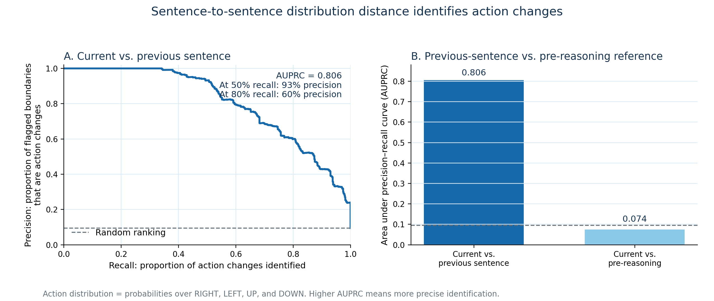
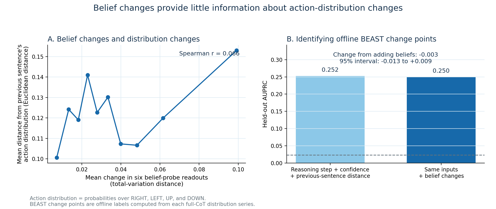

# Distribution changes, action changes, and belief changes

In this report, **action distribution** means the probability distribution over `RIGHT`, `LEFT`, `UP`, and `DOWN`. An **action change** occurs when the highest-probability action differs between consecutive sentence readouts.

## A. Does distribution distance identify action changes?

### Motivation

Distance from the pre-reasoning distribution is the scalar series used in the offline change-point analysis. Distance from the immediately previous sentence may instead provide a direct signal of action changes during a reasoning rollout.

### Result

Across 6,946 sentence boundaries, the recommended action changed 658 times (9.5%). Euclidean distance from the previous sentence's action distribution identified these boundaries with AUPRC 0.806, compared with 0.074 for distance from the pre-reasoning distribution. At approximately 50% recall, the previous-sentence measure achieved 93% precision; at approximately 80% recall, it achieved 60% precision.

## B. Do belief changes identify distribution changes or offline change points?

### Motivation

If belief changes anticipate changes in the action distribution, behavioural probes may help locate cases where the model's represented state and selected action diverge. Offline BEAST locations provide a separate full-trace outcome, although they cannot be detected prospectively by BEAST itself.

### Result

Adjacent changes in the six behavioural-probe readouts had only a weak association with adjacent action-distribution distance (Spearman r = 0.066). Adding belief-change features to reasoning step, action confidence, and previous-sentence distribution distance changed held-out AUPRC for identifying offline BEAST locations from 0.252 to 0.250 (change -0.003; 95% trajectory-resampling interval -0.013 to +0.009).

## Interpretation

The previous-sentence distance is useful for identifying action changes in this dataset; distance from the pre-reasoning distribution is not. The current belief-change summaries do not meaningfully identify either adjacent distribution changes or offline BEAST locations. These results are correlational. In particular, distribution distance and the action-change label are both derived from the same four probabilities.
